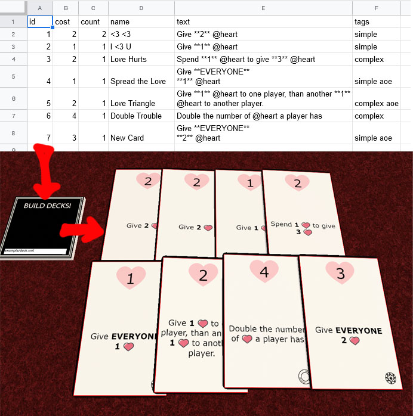

# About



This tool is made to simplify and streamline the process of rendering and uploading playing cards to the Tabletop Simulator. It takes care of most limitations and quirks, like texture size limit, or card number limit, while keeping the total size of the images as small as possible to make your games faster to load and use less memory.

Its main purpose is to help game creators who make lots of changes to their cards and need a fast way to test these changes.

It is a "magic button" solution for importing data from a data source (currently supports Google Spreadsheets), rendering it in a configurable way on as many sheets as required, then uploading these sheets to the TTS, stacking in order, fixing GUIDs, assigning names and description to individual cards as required. 

# Requirements

[Python 3.8](https://www.python.org/downloads/).

[Google Chrome](https://www.google.com/chrome/) (it uses this browser to render card sheets). If you have it installed in some unusual place, then change the path in the `config.ini`.

This tool creates a local web server to talk to TTS. It does not expose the server to the outside world (so it only accepts request from your local computer). It uses the port 17352 by default. If you change the port in the `config.ini`, you then need to change it in the TTS script as well.

# Security

While I make some attempts at securing against bad input and provide basic error checking, you should not use this tool with data you do not trust.

# Usage

Run the `Start.bat` script. It starts listening on a local port 17352 (*by default*).

You can then open the following link in your web browser to test if everything works:
```
http://localhost:17352/?preview&deck=examples/deck.xml
```

After a while, it should render card sheets in the browsers.

To test your own deck, open the link
```
http://localhost:17352/?preview&deck=[path-to-your-deck-xml]
```

# Deck XML

Everything about your deck is configured in the deck's XML file. Check the `examples/deck.xml` for a basic deck example, and `examples/api.xml` for a complete reference.

# TTS Integration

To import your decks in the TTS, you need to make a custom builder object. Simply create a custom tile (you can use textures from the `./tts` folder), and copy-paste the script from `./tts/build-decks.lua` to that component.

*TODO: create workshop component*

Enter the path to your deck's xml into the text field on the component (use `examples/deck.xml` for the example deck).

Click **BUILD DECKS!**, then wait.

*The script needs some space to lay out all the individual cards. If something stacks wrongly, clear more space.*

# Attribution

The examples use icons from the [icons8.com](https://icons8.com) website <3.

The examples use [vector playing cards](https://code.google.com/archive/p/vector-playing-cards/).
